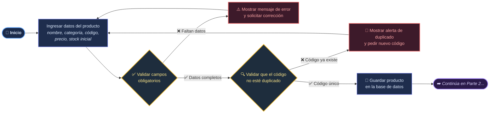
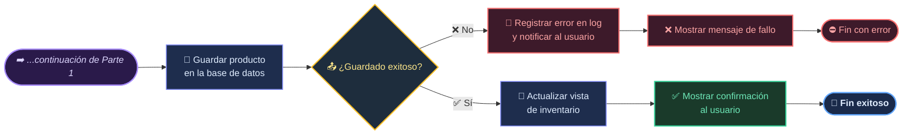

# Introducción

## Tecnologías del Futuro S.A.S

### Sistema de gestión integral para procesos clave

---

## Contexto inicial

Tecnologías del Futuro S.A.S. es una empresa que, como muchas otras, depende de una serie de procesos internos para mantenerse en marcha día a día. Antes de pensar siquiera en construir un software a la medida de sus necesidades, resulta indispensable entender bien cómo funciona cada uno de esos procesos: qué se hace, quién lo hace y por qué se hace de esa manera.

Por eso, en este informe nos concentramos en los procesos que están directamente relacionados con el sistema que se busca desarrollar. Para cada uno se detallan sus **entradas**, **salidas**, los **actores** involucrados y las **reglas de negocio** que los rigen, de modo que quede un panorama claro antes de pasar a la etapa de diseño.

---

## Procesos relacionados directamente con el software

Estos son los procesos que tienen una conexión directa con el sistema que se va a construir:

| Número | Proceso | Descripción breve |
| ------ | ------- | ----------------- |
| 1 | Gestión de inventarios | Se encarga del registro de productos y del control de las cantidades que entran y salen. |
| 2 | Gestión de ventas | Cubre la atención al cliente, la facturación, los pagos y la generación de reportes. |
| 3 | Gestión de clientes | Incluye el registro de clientes, su historial de compras y la comunicación con ellos. |
| 4 | Gestión de proveedores | Abarca el registro de proveedores, las órdenes de compra y su evaluación. |

Vale la pena señalar que estos procesos no funcionan de forma aislada, sino que constantemente intercambian información entre sí. Un ejemplo sencillo: cada vez que se concreta una venta, el inventario disminuye y esa operación queda registrada automáticamente en el historial del cliente correspondiente.

---

## Técnicas de análisis de procesos utilizadas

Para levantar la información que aquí se presenta, se recurrió a tres técnicas complementarias:

### Entrevistas

Consisten en conversar directamente con los responsables de cada área para entender sus necesidades, los problemas que enfrentan a diario y lo que esperan del nuevo sistema.

*Ejemplo:* Preguntarle al encargado de inventario cómo registra actualmente los productos que van llegando.

### Observación

Se trata de acompañar a los trabajadores mientras realizan sus labores cotidianas, para ver de primera mano cómo se hacen las cosas en la práctica y no solo cómo se supone que deberían hacerse.

*Ejemplo:* Presenciar el proceso real de registro de entradas y salidas de mercancía.

### Revisión de documentos

Consiste en examinar facturas, órdenes de compra, reportes y otros registros que ya existen dentro de la empresa, para entender qué información se maneja hoy en día.

*Ejemplo:* Revisar una factura para identificar qué datos exactamente debería capturar el sistema.

---

## Caracterización de procesos

### 1. Gestión de inventarios

*Se ocupa del control completo de los productos: su ingreso, su salida y las existencias disponibles en todo momento.*

| Elemento | Descripción |
| -------- | ----------- |
| Entradas | Información de los productos, mercancía recibida, órdenes de compra y productos que ya se vendieron. |
| Actividades | Registrar productos y sus movimientos (entradas y salidas), consultar el stock disponible, revisar si se llegó al stock mínimo y generar las alertas correspondientes. |
| Salidas | Inventario al día, reportes, alertas de stock mínimo y un registro detallado de movimientos. |
| Actores | Administrador, encargado de inventario, proveedor y el propio sistema. |
| Reglas de negocio | Todo producto debe quedar registrado. Cada entrada y cada salida tiene que quedar documentada. El stock nunca puede ser negativo. Cuando se alcanza el stock mínimo, el sistema debe generar una alerta automáticamente. |

---

### 2. Gestión de ventas

*Es el proceso comercial que va desde que se atiende al cliente hasta que el pago queda debidamente registrado.*

| Elemento | Descripción |
| -------- | ----------- |
| Entradas | Datos del cliente, productos que solicita, cantidades y la información relacionada con el pago. |
| Actividades | Atender al cliente, verificar si hay disponibilidad del producto, registrar la venta, generar la factura, registrar el pago y actualizar el inventario. |
| Salidas | Factura generada, venta registrada, pago registrado, inventario actualizado y los reportes correspondientes. |
| Actores | Cliente, vendedor, administrador y el sistema. |
| Reglas de negocio | No se puede vender un producto si no hay existencias. Toda venta debe quedar registrada y generar su respectiva factura. El inventario se actualiza automáticamente después de cada venta. |

---

### 3. Gestión de clientes

*Comprende la administración de los datos de los clientes y el seguimiento de su historial de compras.*

| Elemento | Descripción |
| -------- | ----------- |
| Entradas | Nombre, documento de identidad, teléfono, correo electrónico y las compras que ha realizado. |
| Actividades | Registrar, actualizar y consultar clientes, revisar su historial de compras y mantener comunicación con ellos. |
| Salidas | Cliente registrado, datos actualizados, historial de compras disponible y reportes. |
| Actores | Cliente, vendedor, administrador y el sistema. |
| Reglas de negocio | Todo cliente debe contar con datos básicos registrados. Esa información debe mantenerse al día. Cada compra debe quedar asociada al cliente que la realizó. |

---

### 4. Gestión de proveedores

*Se encarga de administrar a los proveedores y las compras que se les hacen, con el fin de mantener el inventario siempre abastecido.*

| Elemento | Descripción |
| -------- | ----------- |
| Entradas | Datos del proveedor, productos que se necesitan, cantidades y las órdenes de compra generadas. |
| Actividades | Registrar proveedores, consultarlos, crear órdenes de compra, recibir la mercancía y evaluar su desempeño. |
| Salidas | Proveedor registrado, orden de compra generada, mercancía recibida, evaluación del proveedor e inventario actualizado. |
| Actores | Administrador, encargado de compras, proveedor y el sistema. |
| Reglas de negocio | Todo proveedor debe estar registrado previamente. Las órdenes de compra deben quedar documentadas. La mercancía que llega debe coincidir con lo que se pidió en la orden. La evaluación se hace considerando calidad, precio y cumplimiento de los tiempos acordados. |

## Flujograma - Registro de Productos

## Parte 1: Validación y verificación de duplicados

## Parte 2: Guardado y confirmación

---

## Relación entre los procesos

Ninguno de estos procesos funciona de manera completamente independiente; todos están conectados de una u otra forma. A continuación, dos ejemplos que ilustran bien esa relación:

**Proveedor → Gestión de proveedores → Entrada de mercancía → Inventario**  
Cuando la empresa le compra productos a un proveedor, esa mercancía llega físicamente y queda reflejada en el inventario.

**Cliente → Gestión de clientes → Venta → Gestión de ventas → Inventario**  
Cuando un cliente compra algo, se registra la venta, se actualiza su información como cliente y, al mismo tiempo, se descuenta el producto correspondiente del inventario.

---

## Conclusión

Analizar y caracterizar los procesos de la empresa permite entender mejor cómo opera realmente el negocio y qué puntos podrían mejorarse con la ayuda de un software.

En resumen, los procesos principales que se identificaron son:

- Gestión de inventarios
- Gestión de ventas
- Gestión de clientes
- Gestión de proveedores

Como se pudo ver, todos están relacionados entre sí y dependen de que la información fluya de manera constante entre ellos.

Con base en esto, el software que se desarrolle debería permitir organizar mejor la información, reducir errores humanos, tener un control más preciso sobre los productos y facilitar tanto la generación de reportes como el envío de alertas. En conjunto, esto se traduce en una gestión más eficiente y confiable para la empresa.

---

## Guía de Recolección de Requisitos de Software

**Empresa:** Tecnologías del Futuro S.A.S.  
**Objetivo:** Identificar requisitos para la automatización de los procesos de gestión de inventarios y ventas.  

### 1. Métodos de Recolección de Información

| Método | Definición | Propósito en este proyecto |
| --- | --- | --- |
| **Entrevista** | Diálogo estructurado o semiestructurado con personal clave del proceso. | Profundizar en los detalles operativos, las problematicas reales y las expectativas específicas de gerentes, vendedores y personal de bodega. |
| **Encuesta** | Instrumento estandarizado aplicado a una muestra amplia de usuarios. | Cuantificar frecuencias de errores, tiempos de respuesta y niveles de satisfacción para priorizar los problemas más recurrentes. |
| **Observación** | Registro sistemático y en tiempo real de las actividades y flujos de trabajo. | Validar la diferencia entre el proceso teórico y el proceso real (lo que realmente hacen), identificando cuellos de botella físicos. |

---

### 2. Banco de Preguntas y Criterios de Evaluación

#### 2.1. Entrevista

*Dirigidas a gerentes, personal de bodega y vendedores.*

1. ¿Cuál es su rol exacto y qué responsabilidades tiene sobre inventarios o ventas?
2. Describa paso a paso cómo registra un nuevo producto en el inventario hoy.
3. ¿Qué pasos sigue desde que un cliente solicita un producto hasta que se lo entrega?
4. ¿Con qué frecuencia ocurren errores en el registro y de qué tipo son principalmente?
5. ¿Cuál cree que es la causa principal de estos errores en el proceso manual?
6. ¿Cómo se entera actualmente de que un producto está agotado o con stock bajo?
7. ¿Qué hace cuando un cliente pregunta por disponibilidad y no tiene el dato a la mano?
8. ¿Cuánto tiempo tarda en promedio en completar el registro de una venta típica?
9. ¿Qué documentos o formatos en papel utiliza de forma obligatoria cada día?
10. ¿Qué información considera que se pierde o nunca llega a registrarse?
11. ¿Cómo se comunica con el área de bodega para confirmar existencias en tiempo real?
12. ¿Qué dificultades enfrenta al intentar rastrear el historial de movimiento de un producto?
13. ¿Qué herramientas de apoyo usa para compensar lo manual?
14. ¿Qué consecuencias tangibles ha tenido la falta de trazabilidad para la empresa?
15. ¿Cómo maneja el proceso de devoluciones o cambios de productos actualmente?
16. ¿Qué expectativas concretas tiene sobre el nuevo sistema de información?
17. ¿Qué funciones considera absolutamente indispensables que tenga el nuevo software?
18. ¿Qué preocupaciones le genera el cambio de un sistema manual a uno digital?
19. ¿Cuánto tiempo real estaría dispuesto a invertir en capacitarse para el nuevo sistema?
20. ¿Cómo cree que el nuevo sistema cambiará su rutina laboral diaria?
21. ¿Qué datos específicos necesita ver en un reporte diario para tomar decisiones?
22. ¿Quién aprueba las compras de reposición de inventario y cómo se le solicita?
23. ¿Cómo se aplican y registran los descuentos o promociones en las ventas actuales?
24. ¿Qué protocolo sigue si se va la luz o falla el equipo durante un registro crítico?
25. ¿Existen procesos o métodos propios que no estén documentados oficialmente?
26. ¿Cómo valida que la información registrada por un compañero sea correcta?
27. ¿Qué tipo de clientes atiende y cuáles son sus quejas más frecuentes sobre el proceso?
28. ¿Cómo se realiza el cierre de caja o el conteo de inventario al final del día?
29. ¿Qué diferencias nota entre el procedimiento escrito oficial y lo que realmente se hace?
30. ¿Cómo se almacena y protege la información de contacto e historial de los clientes?
31. ¿Con qué frecuencia necesita consultar el precio de un producto y cómo lo hace?
32. ¿Existen productos con manejo especial y cómo se registra eso?
33. ¿Cómo se coordina con los proveedores para la recepción de nueva mercancía?
34. ¿Qué métricas o números revisa personalmente para saber si su área funciona bien?
35. ¿Qué opina honestamente de la velocidad de respuesta actual hacia los clientes?
36. ¿Quién tiene la autoridad real para modificar un registro de inventario ya cerrado?
37. ¿Cómo se manejan las ventas a crédito, apartados o pendientes de pago?
38. ¿Qué alertas le gustaría que el sistema le enviara automáticamente?
39. ¿Ha participado antes en la implementación de algún software? ¿Qué aprendió de ello?
40. ¿Hay algo crítico sobre el proceso actual que no le haya preguntado y deba saber?

---

#### 2.2. Encuesta

*Diseñadas para escalas de frecuencia, tiempo o niveles de satisfacción.*

1. ¿Con qué frecuencia comete o detecta errores en el registro manual de inventarios?
2. ¿Cuánto tiempo tarda en promedio en buscar la existencia de un producto?
3. ¿Qué tan satisfecho está con la velocidad de atención al cliente en el proceso actual?
4. ¿Con qué frecuencia se queda sin stock de un producto sin alerta previa?
5. ¿Cuántos formatos físicos o hojas de papel llena aproximadamente por día?
6. ¿Qué tan claro tiene el flujo completo del proceso de ventas e inventarios?
7. ¿Con qué frecuencia los clientes se quejan por demoras en la confirmación de pedidos?
8. ¿Qué tan difícil le resulta rastrear el historial de un producto específico?
9. ¿Cuántas veces al día interrumpe a un compañero para verificar un dato de inventario?
10. ¿Qué tan confiable considera que es la información de inventario que maneja hoy?
11. ¿Con qué frecuencia ocurren discrepancias entre el inventario físico y el registrado en papel?
12. ¿Qué tan preparado se siente para aprender a usar un nuevo sistema de información?
13. ¿Cuál es el principal motivo de pérdida de tiempo en su jornada laboral actual?
14. ¿Con qué frecuencia tiene que corregir un registro de venta ya realizado?
15. ¿Qué tan importante es para usted que el nuevo sistema genere reportes automáticos?
16. ¿Cuántas horas a la semana dedica exclusivamente a conciliar inventario?
17. ¿Con qué frecuencia se pierden o extravían documentos físicos de ventas o remisiones?
18. ¿Qué tan satisfecho está con la comunicación actual entre ventas y bodega?
19. ¿Con qué frecuencia los clientes cancelan una compra por la demora en la respuesta?
20. ¿Qué tan útil le sería una alerta automática de stock mínimo en su trabajo?
21. ¿Cuántos pasos manuales identifica en el proceso de registro de una sola venta?
22. ¿Con qué frecuencia debe recalcular precios o descuentos de forma manual?
23. ¿Qué tan fácil le resulta identificar qué empleado realizó un registro específico?
24. ¿Con qué frecuencia se presentan devoluciones por errores en el despacho del producto?
25. ¿Qué tan importante considera que es la trazabilidad de los productos para la empresa?
26. ¿Cuántas veces al mes realiza conteos físicos de inventario no programados?
27. ¿Con qué frecuencia la falta de un dato retrasa el cierre de sus actividades diarias?
28. ¿Qué tan cómodo se siente utilizando herramientas digitales básicas?
29. ¿Con qué frecuencia los proveedores entregan mercancía sin que se registre de inmediato?
30. ¿Qué tan de acuerdo está con que el proceso actual es propenso a errores humanos?
31. ¿Cuánto tiempo tarda en promedio en elaborar el reporte de cierre diario?
32. ¿Con qué frecuencia necesita acceder a información de clientes de años anteriores?
33. ¿Qué tan satisfecho está con el espacio físico y las condiciones para realizar su trabajo?
34. ¿Con qué frecuencia se duplica el registro de un mismo producto por error?
35. ¿Qué tan importante es para usted poder acceder al sistema desde diferentes dispositivos?
36. ¿Cuántas quejas de clientes ha atendido este mes relacionadas con inventario o ventas?
37. ¿Con qué frecuencia se siente sobrecargado por la cantidad de registros manuales?
38. ¿Qué tan fácil le resulta capacitar a un nuevo empleado en el proceso actual?
39. ¿Con qué frecuencia se toman decisiones de compra basadas en datos inexactos?
40. ¿Qué prioridad le da a la implementación del nuevo sistema frente a otras necesidades?

---

#### 2.3. Observación

*Lista de verificación para el analista durante la observación directa del proceso.*

1. ¿Qué pasos exactos sigue el empleado desde que recibe la solicitud hasta completarla?
2. ¿Qué documentos físicos están sobre el escritorio y en qué estado se encuentran?
3. ¿Cuántas veces el empleado debe levantarse de su puesto para buscar información o productos?
4. ¿Qué herramientas no informáticas usa constantemente?
5. ¿Cuánto tiempo real transcurre entre que el cliente pide un producto y se le confirma su existencia?
6. ¿En qué momentos del proceso el empleado duda o busca información en otro lugar?
7. ¿Cómo se archivan los registros al final del día: ordenados o amontonados?
8. ¿Qué interrupciones recibe el empleado durante el proceso?
9. ¿El empleado sigue el procedimiento formal o ha desarrollado atajos propios no documentados?
10. ¿Qué tan legibles son los registros manuales realizados por los diferentes empleados?
11. ¿Dónde se almacenan físicamente los productos y qué tan accesibles están para el conteo?
12. ¿Cuántas personas intervienen en un solo proceso de registro de venta o inventario?
13. ¿Qué hace el empleado cuando no encuentra un producto en el registro físico?
14. ¿Se observan tachones, correcciones o uso de corrector en los documentos de registro?
15. ¿Cuánto tiempo pasa el empleado buscando un precio o código de producto específico?
16. ¿El ambiente de trabajo afecta la concentración en el registro?
17. ¿Cómo se verifica físicamente que la mercancía entrante coincide con la factura del proveedor?
18. ¿Qué señales visuales usa el empleado para recordar tareas?
19. ¿Cuánto tiempo tarda el empleado en reconciliar el efectivo o registros al final del turno?
20. ¿Se observan productos sin etiqueta, con etiqueta dañada o con información incompleta?
21. ¿El empleado utiliza algún dispositivo personal para apoyar su trabajo?
22. ¿Qué distancia física hay entre el punto de venta y el lugar donde se consulta el inventario?
23. ¿Cómo reacciona el empleado cuando un cliente le apura durante la búsqueda de datos?
24. ¿Se observan duplicidades de información en diferentes libretas o formatos?
25. ¿Qué tan seguido el empleado debe pedir ayuda a un compañero para completar una tarea?
26. ¿El flujo físico de la mercancía coincide con el flujo del registro en papel?
27. ¿Qué documentos quedan pendientes de llenar al final de la jornada y por qué?
28. ¿Se observa algún riesgo de seguridad en el manejo de la información?
29. ¿Cuántas veces se repite la misma pregunta o se solicita el mismo dato en diferentes etapas?
30. ¿El empleado muestra signos de fatiga o frustración al realizar tareas repetitivas de registro?
31. ¿Cómo se manejan las excepciones en el momento exacto en que ocurren?
32. ¿Qué tan organizado está el espacio de trabajo para facilitar la agilidad en la atención?
33. ¿Se observan retrasos en la cadena cuando una persona clave no está presente en su puesto?
34. ¿El empleado verifica la información antes de entregarla al cliente o al siguiente eslabón?
35. ¿Cuánto tiempo pasa un documento en espera sobre el escritorio antes de ser procesado?
36. ¿Existen cuellos de botella visibles donde se acumulan pedidos o registros sin procesar?
37. ¿Cómo se comunica el empleado de ventas con el de bodega?
38. ¿Se observan errores sistemáticos?
39. ¿El empleado tiene a la mano toda la información necesaria o debe buscarla activamente?
40. ¿Qué diferencias existen entre lo que hace un empleado nuevo a uno con experiencia en el mismo proceso?
